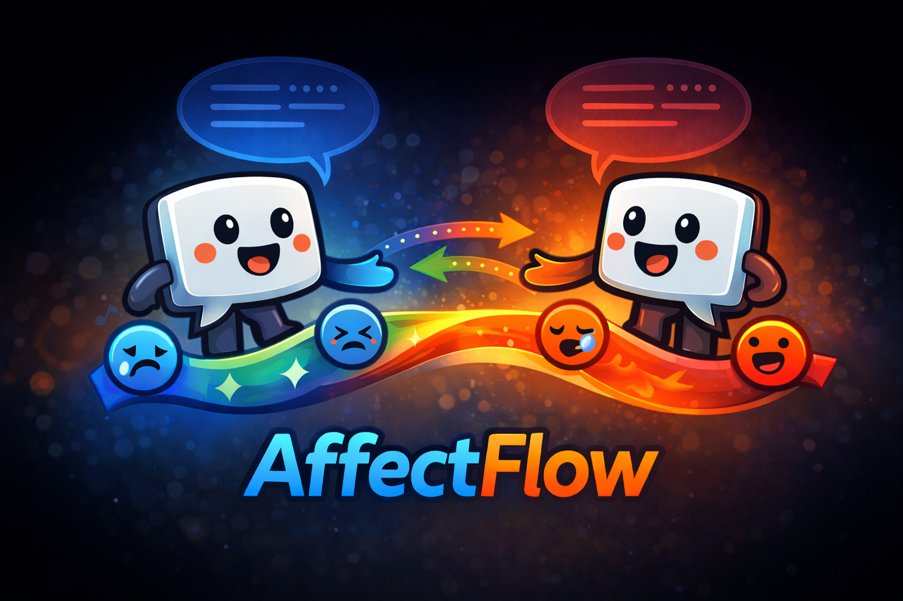
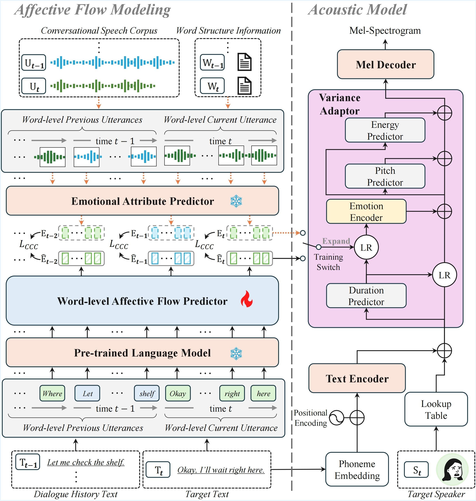

<div align="center">


## AffectFlow: Word-Level Affective Flow Modeling for Conversational Speech Synthesis

</div>
<div align="center">
<picture>
  <source media="(prefers-color-scheme: dark)" srcset="Figures/affectflow_mascot_2.png">
  
</picture>

</div>

<div align="center">

<a href="https://emodemopage.github.io/AffectFlow-Demo/" target="_blank">
  
</a>

</div>


<br>

## 📰 News
- **2026-03-09**: We officially released **AffectFlow**, along with an interactive demo page!

<br>

## ⭐ TODO
- [x] Codebase upload
- [x] Environment setup
- [x] Training and Inference guidance
- [ ] Pretrained checkpoints

<br>

## Introduction
<div align="center">
  
  <br>
  <em>Overall framework of AffectFlow.</em>
</div>

### Abstract
Conversational speech synthesis (CSS) aims to generate expressive speech that is coherent with conversational context, capturing prosodic and affective nuances. However, existing approaches either fail to align speech with the emotional context or rely on global utterance-level affective states, limiting their ability to model fine-grained and temporally evolving affective dynamics. To address these limitations, we propose AffectFlow, a novel framework that explicitly models fine-grained affective dynamics at the word level for CSS. To the best of our knowledge, this is the first work to introduce word-level affective flow modeling for CSS grounded in empirical conversational analysis. Specifically, we introduce an affective flow predictor that captures local affective transitions, speaker-specific continuity, and global emotional evolution. Comprehensive subjective and objective evaluations demonstrate that AffectFlow effectively captures contextual prosodic and affective nuances.


## 0. Environment setup

### Library
- <a href="https://www.python.org/">Python</a> >= 3.10
- <a href="https://pytorch.org/get-started/pytorch-2.0/">PyTorch</a> >= 2.0 (Recommand)
- <a href="https://pytorch.org/get-started/pytorch-2.0/">CUDA</a> >= 11.6


```bash
  # Docker image
  DOCKER_IMAGE=nvcr.io/nvidia/pytorch:24.02-py3
  docker pull $DOCKER_IMAGE

  # Set docker config
  CONTAINER_NAME=YOUR_CONTAINER_NAME
  SRC_CODE=YOUR_CODE_PATH
  TGT_CODE=DOCKER_CODE_PATH
  SRC_DATA=YOUR_DATA_PATH
  TGT_DATA=DOCKER_DATA_PATH
  SRC_CKPT=YOUR_CHECKPOINT_PATH
  TGT_CKPT=DOCKER_CHECKPOINT_PATH
  SRC_PORT=6006
  TGT_PORT=6006
  docker run -itd --ipc host --name $CONTAINER_NAME -v $SRC_CODE:$TGT_CODE -v $SRC_DATA:$TGT_DATA -v $SRC_CKPT:$TGT_CKPT -p $SRC_PORT:$TGT_PORT --gpus all --restart=always $DOCKER_IMAGE
  docker exec -it $CONTAINER_NAME bash

  apt-get update
  # Install tmux
  apt-get install tmux -y
  # Install espeak
  apt-get install espeak -y

  # Clone repository in docker code path
  git clone https://github.com/EmoDemoPage/AffectFlow.git

  pip install -r requirements.txt
```

### Vocoder
- [[HiFi-GAN]](https://github.com/jik876/hifi-gan)


## 1. Preprocess data
- Modify the config file to fit your environment.
- We use DailyTalk database, which is a high-quality conversational speech dataset that can be downloaded here: https://github.com/keonlee9420/DailyTalk.

## Preprocessing
For binary dataset creation, we follow the pipeline from [[NATSpeech]](https://github.com/NATSpeech/NATSpeech).


### 2. Training TTS module and Inference  
```bash
sh AffectFlow.sh
```

## 3. Pretrained checkpoints

To preserve anonymity and avoid download tracking during the review process, pretrained checkpoints will be released **after the review is completed**.

<br>

## 4. Acknowledgements
**Our codes are based on the following repos:**
* [NATSpeech](https://github.com/NATSpeech/NATSpeech)
* [PyTorch Lightning](https://github.com/PyTorchLightning/pytorch-lightning)
